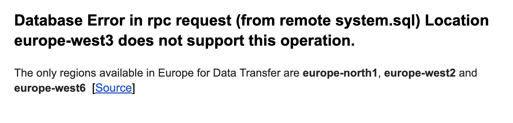

# Week 4 Seb

## Question 1: **What is the count of records in the model fact_trips after running all models with the test run variable disabled and filtering for 2019 and 2020 data only (pickup datetime)?** 

```sql
SELECT COUNT(*)
FROM `aqueous-abbey-375520.production.fact_trips`
WHERE pickup_datetime BETWEEN '2019-01-01' AND '2020-12-31';
```

- 41648442
- 51648442
`- 61648442`
- 71648442


## Question 2: **What is the distribution between service type filtering by years 2019 and 2020 data as done in the videos?**

```sql
SELECT service_type,
       count(*) / (SELECT COUNT(*) FROM `aqueous-abbey-375520.production.fact_trips`) * 100
FROM `aqueous-abbey-375520.production.fact_trips`
GROUP BY service_type;
```

- `89.9/10.1`
- 94/6
- 76.3/23.7
- 99.1/0.9

## Question 3: **What is the count of records in the model stg_fhv_tripdata after running all models with the test run variable disabled (:false)?**  

Create a staging model for the fhv data for 2019 and do not add a deduplication step. Run it via the CLI without limits (is_test_run: false).
Filter records with pickup time in year 2019.

```sql
SELECT COUNT(*) 
FROM `aqueous-abbey-375520.trips_data_all.stg_fhv_tripdata`;
```

- 33244696
- `43244696`
- 53244696
- 63244696


## Question 4

**What is the count of records in the model fact_fhv_trips after running all dependencies with the test run variable disabled (:false)?**  

```sql
SELECT count(*) 
FROM `aqueous-abbey-375520.trips_data_all.fact_fhv_trips`;
```

- 12998722
- `22998722`
- 32998722
- 42998722

## Question 5

**What is the month with the biggest amount of rides after building a tile for the fact_fhv_trips table?**

Create a dashboard with some tiles that you find interesting to explore the data. One tile should show the amount of trips per month, as done in the videos for fact_trips, based on the fact_fhv_trips table.

Retrived my response via Data Studio.

- March
- April
- `January`
- December

## Submitting the solutions

* Form for submitting: https://forms.gle/6A94GPutZJTuT5Y16
* You can submit your homework multiple times. In this case, only the last submission will be used. 

Deadline: 25 February (Saturday), 22:00 CET


## Solution

We will publish the solution here

## Help

"Database Error in rpc request (from remote system.sql) Location europe-west3 does not support this operation."
Help: The only regions available in Europe for Data Transfer are europe-north1, europe-west2 and europe-west6  [Source]



## Social Media

- Twitter: https://twitter.com/sbstn2809/status/1627887537112117248
- Facebook: https://www.facebook.com/seduerr/posts/pfbid081as5faNQzhusMEaSRc1HEmev3BnB9shqRywregNrRwDX7jWYCGnd8jvF5UdvZotl