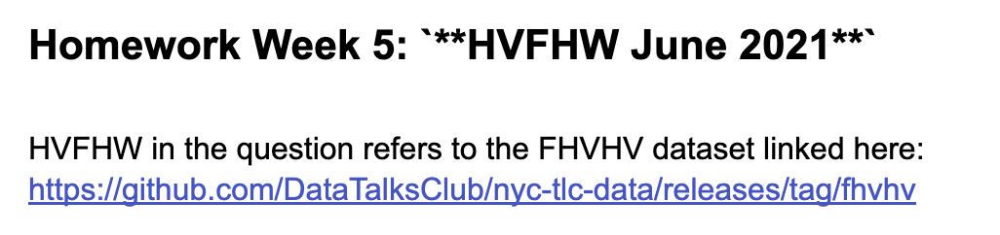

# Seb Week 5 DEZ

## Week 5 Homework

### Question 1

**Install Spark and PySpark**


What's the output?

- `3.3.2`
- 2.1.4
- 1.2.3
- 5.4

```bash
SparkSession - in-memory
SparkContext
Spark UI
Version
v3.3.2
Master
local[*]
AppName
test
```

### Question 2

**HVFHW June 2021**

```bash
 seb@dez-instance:~/spark/notebooks/data/fhvhv/2021/06$ ls -laSh
total 662M
-rw-r--r-- 1 seb seb  55M Mar  5 23:04 part-00009-f2e60858-6ef8-4238-9e41-0f429a08f943-c000.snappy.parquet
-rw-r--r-- 1 seb seb  55M Mar  5 23:04 part-00007-f2e60858-6ef8-4238-9e41-0f429a08f943-c000.snappy.parquet
-rw-r--r-- 1 seb seb  55M Mar  5 23:04 part-00008-f2e60858-6ef8-4238-9e41-0f429a08f943-c000.snappy.parquet
-rw-r--r-- 1 seb seb  55M Mar  5 23:04 part-00001-f2e60858-6ef8-4238-9e41-0f429a08f943-c000.snappy.parquet
-rw-r--r-- 1 seb seb  55M Mar  5 23:04 part-00011-f2e60858-6ef8-4238-9e41-0f429a08f943-c000.snappy.parquet
-rw-r--r-- 1 seb seb  55M Mar  5 23:04 part-00010-f2e60858-6ef8-4238-9e41-0f429a08f943-c000.snappy.parquet
-rw-r--r-- 1 seb seb  55M Mar  5 23:04 part-00006-f2e60858-6ef8-4238-9e41-0f429a08f943-c000.snappy.parquet
-rw-r--r-- 1 seb seb  55M Mar  5 23:04 part-00000-f2e60858-6ef8-4238-9e41-0f429a08f943-c000.snappy.parquet
-rw-r--r-- 1 seb seb  55M Mar  5 23:04 part-00004-f2e60858-6ef8-4238-9e41-0f429a08f943-c000.snappy.parquet
-rw-r--r-- 1 seb seb  55M Mar  5 23:04 part-00002-f2e60858-6ef8-4238-9e41-0f429a08f943-c000.snappy.parquet
-rw-r--r-- 1 seb seb  55M Mar  5 23:04 part-00005-f2e60858-6ef8-4238-9e41-0f429a08f943-c000.snappy.parquet
-rw-r--r-- 1 seb seb  55M Mar  5 23:04 part-00003-f2e60858-6ef8-4238-9e41-0f429a08f943-c000.snappy.parquet
```

- 2MB
- `24MB` actally each of them is 55megs but.
- 100MB
- 250MB

### Question 3

How many taxi trips were there on June 15?</br></br>
Consider only trips that started on June 15.</br>

- 308,164
- 12,856
- `452,470`
- 50,982

Query: 

```python
spark.sql("""
SELECT COUNT(*) 
FROM  trips_data
WHERE pickup_datetime BETWEEN '2021-06-15 00:00:00' AND '2021-06-15 23:59:59'
""").show()
```

### Question 4

Now calculate the duration for each trip.</br>
How long was the longest trip in Hours?</br>

```python
spark.sql("""
SELECT MAX(DATEDIFF(HOUR, pickup_datetime, dropoff_datetime)) 
FROM trips_data;
""").show()
```

- `66.87 Hours`
- 243.44 Hours
- 7.68 Hours
- 3.32 Hours

### Question 5

Spark’s User Interface which shows application's dashboard runs on which local port?</br>

- 80
- 443
- `4040`
- 8080

### Question 6

Load the zone lookup data into a temp view in Spark</br>
[Zone Data](https://github.com/DataTalksClub/nyc-tlc-data/releases/download/misc/taxi_zone_lookup.csv)</br>

Using the zone lookup data and the fhvhv June 2021 data, what is the name of the most frequent pickup location zone?</br>

- East Chelsea, 68,"Manhattan","East Chelsea","Yellow Zone"
- Astoria, 7,"Queens","Astoria","Boro Zone"
- Union Sq, 234,"Manhattan","Union Sq","Yellow Zone"
- `Crown Heights North, 61,"Brooklyn","Crown Heights North","Boro Zone"`


```python
spark.sql("""
SELECT PULocationID, COUNT(*) as count
FROM trips_data
WHERE PULocationID IN (68,7,234,61)
GROUP BY PULocationID
ORDER BY count DESC
LIMIT 1;
""").show()
```

## Seb Help

Homework Week 5: `**HVFHW June 2021**`

HVFHW in the question refers to the FHVHV dataset linked here: <https://github.com/DataTalksClub/nyc-tlc-data/releases/tag/fhvhv>



## Public 

- [Facebook](https://www.facebook.com/plugins/post.php?href=https%3A%2F%2Fwww.facebook.com%2Fseduerr%2Fposts%2Fpfbid0nnSrCKoxsepzC6pV9BAvsxWt3sRpqivJ5jgnaLS2iU9CNmP81QWLEoQe4fMKFhhyl&show_text=true&width=500)
- [Twitter](https://twitter.com/sbstn2809/status/1632528011970113538)


## My Notes to get server started

Remote connection via SSH

Next: `cd ~/.ssh; nano gcp` and then change the IP.

Then, `ssh seb`

Then: `cd spark/`

And finally:

```bash
export PATH="${JAVA_HOME}/bin:${PATH}"
export SPARK_HOME="${HOME}/spark/spark-3.3.2-bin-hadoop3"
export JAVA_HOME="${HOME}/spark/jdk-11.0.1"
export PYTHONPATH="${SPARK_HOME}/python/:$PYTHONPATH"
export PYTHONPATH="${SPARK_HOME}/python/lib/py4j-0.10.9.5-src.zip:$PYTHONPATH"
```

Then: `jupyter notebook`